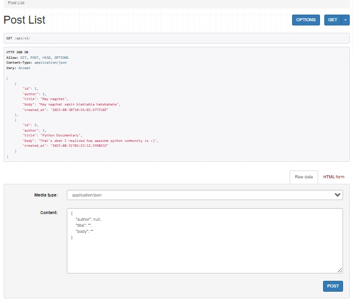

# Django REST Framework
Remember that API in Django relies in 3 things: `url`, `serializers`, `views`,

- `urls.py` file for the URL routes
- `serializers.py` file to transform the data into JSON
- `views.py` file to apply logic to each API endpoint

1.  `pip install` the drf and add it to the `INSTALLED_APPS` and the configure it `<project_name>/settings.py`
```python
INSTALLED_APPS = [
    'django.contrib.admin',
    'django.contrib.auth',
    'django.contrib.contenttypes',
    'django.contrib.sessions',
    'django.contrib.messages',
    'django.contrib.staticfiles',

    # 3rd party apps
    'rest_framework',

    # local apps
    'accounts.apps.AccountsConfig',
    'posts.apps.PostsConfig',
]

REST_FRAMEWORK = {
    "DEFAULT_PERMISSION_CLASSES": [
        "rest_framework.permissions.AllowAny", # remember this is bad
    ],
}
```
## Now we need to create URLs, Views, Serializers
2. Configure URLs
    - URLs can be configured on the project level and app level
in project level:
```python
# django_project/urls.py
urlpatterns = [
    path('admin/', admin.site.urls),
    path('api/v1/', include('posts.urls'))  # we used posts app
]
```
> note that it would make more sense to create another app called apis if we have a lot of apps

in app level:
- create a `posts/urls.py`

```python
from django.urls import path

from .views import PostList, PostDetail  # these are classes inside the views.py

urlpatterns = [
    path('<int:pk>', PostDetail.as_view(), name="post_detail"),
    path("", PostList.as_view(), name="post_list"),
]
```
3. Serializers
- Main goal is to serialize models into JSON, what cool is you exclude, what you don't want to expose from your models
- In our case we will include the `id` field but we will exclude `updated_at`, these are just fields in our `Post` model
```python
# posts/serializers.py
from rest_framework import serializers 

from .models import Post

class PostSerializer(serializers.ModelSerializer):
    class Meta:
        fields = (
            'id',
            'author',
            'title',
            'body',
            'created_at',
        )

        model = Post
```
4. Views
There are lots of generic views and we have used:
- `ListAPIView`: a read-only to expose all data
- `RetrieveAPIView`: for a read only single endpoint
There is also a `ListCreateAPIView`: Similar to `ListAPIView` but it allows for writes and therefore `POST` request

## `ListCreateAPIView` & `RetrieveUpdateDestroyAPIView`

The latter allows for individual editing, reading, and deleting.
```python
from django.shortcuts import render

# Create your views here.
from rest_framework import generics
from .models import Post

from .serializers import PostSerializer

class PostList(generics.ListCreateAPIView):
    queryset = Post.objects.all() 
    serializer_class = PostSerializer

class PostDetail(generics.RetrieveUpdateDestroyAPIView):
    queryset = Post.objects.all()
    serializer_class =  PostSerializer
```
## Browsable API
This is what's gonna be displayed:


Now see that the author is just an `id`, would not it be nice if it were an object too? 

Now that is up to you and here is a note:

This passage means that **serializers** in the Django REST Framework are flexible tools for converting complex data, like database models, into formats easily sent over an API, such as JSON.

---

### Key Points

* **Customizable Power:** You can customize serializers to control exactly what data is included in the output and what validation rules are applied.
* **Performance Optimization:** The passage highlights a key performance consideration. While serializers are powerful, they **don't automatically optimize database queries**. The framework avoids this "magic" because it would be too complex and unpredictable.
* **Manual Optimization:** This means that on larger websites or applications, developers must manually optimize database queries using methods like **`select_related`** and **`prefetch_related`** to prevent performance issues. This is a crucial task for ensuring the site remains fast and responsive as it scales.

In short, the text emphasizes that while serializers are versatile, their performance relies on a developer's manual effort to optimize database queries, a trade-off made for simplicity and predictability within the framework.