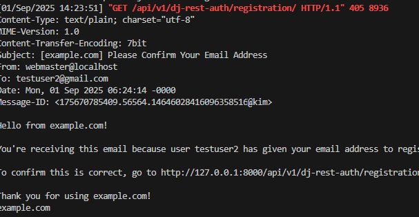
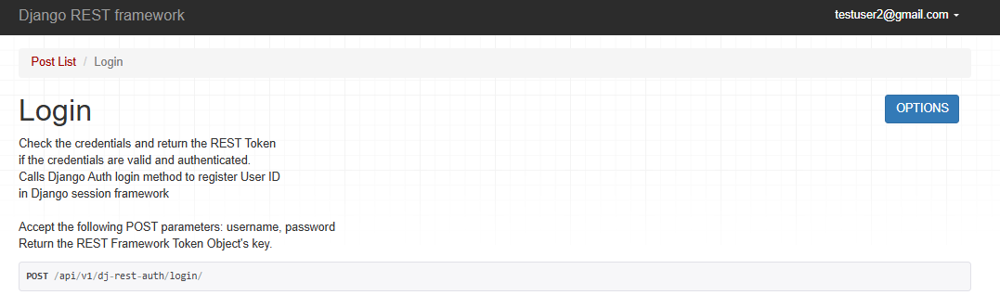

We would want to create endpoints so users can log in and out. 
- To not make a mistake we shall use `dj-rest-auth` in combination with `django-allauth`

## `dj-rest-auth` login, logout, password reset
### Create log in log out and password reset
- install `dj-rest-auth`
- add the new app in `django_project/settings.py`
```python
INSTALLED_APPS = [
    'django.contrib.admin',
    'django.contrib.auth',
    'django.contrib.contenttypes',
    'django.contrib.sessions',
    'django.contrib.messages',
    'django.contrib.staticfiles',

    # 3rd party apps
    'rest_framework',
    'corsheaders', 
    'rest_framework.authtoken',
    'dj_rest_auth',

    # local apps
    'accounts.apps.AccountsConfig',
    'posts.apps.PostsConfig',
]
```
- update the `django_project/urls.py`
```python
urlpatterns = [
    path('admin/', admin.site.urls),
    path('api/v1/', include('posts.urls')),
    path("api-auth/", include('rest_framework.urls')),
    path("api/v1/dj-rest-auth/", include("dj_rest_auth.urls")),  # new

    # you can change the path, not fixed
]
```
Now remember that when you have an app it's a folder with `urls.py` now that you have included the `dj-rest-auth`, you have endpoints such as:
- login: `http://127.0.0.1:8000/api/v1/dj-rest-auth/login/`
- logout: `http://127.0.0.1:8000/api/v1/dj-rest-auth/logout/`
- password-reset:  (`http://127.0.0.1:8000/api/v1/dj-rest-auth/password/reset`)
- password-reset-confirmation:  (`http://127.0.0.1:8000/api/v1/dj-rest-auth/password/reset/confirm`)

### User Registration: sign up/registration endpoint
1. pip install `django-allauth`
2. update `INSTALLED_APPS`
```python
INSTALLED_APPS = [
    'django.contrib.admin',
    'django.contrib.auth',
    'django.contrib.contenttypes',
    'django.contrib.sessions',
    'django.contrib.messages',
    'django.contrib.staticfiles',
    'django.contrib.sites',  # new

    # 3rd party apps
    'rest_framework',
    'corsheaders', 
    'rest_framework.authtoken',
    'dj_rest_auth',
    'allauth',  # new
    'allauth.account',  # new
    'allauth.socialaccount',  # new
    'dj_rest_auth.registration',
    # local apps
    'accounts.apps.AccountsConfig',
    'posts.apps.PostsConfig',
]
```
3. Add this to the middleware settings:
```python
# allauth.account.middleware.AccountMiddleware
MIDDLEWARE = [
    'django.middleware.security.SecurityMiddleware',
    'django.contrib.sessions.middleware.SessionMiddleware',
    'corsheaders.middleware.CorsMiddleware',  # new
    'django.middleware.common.CommonMiddleware',
    'django.middleware.csrf.CsrfViewMiddleware',
    'django.contrib.auth.middleware.AuthenticationMiddleware',
    'allauth.account.middleware.AccountMiddleware',
    'django.contrib.messages.middleware.MessageMiddleware',
    'django.middleware.clickjacking.XFrameOptionsMiddleware',
]
```
4. `django-allauth` needs to be added to the `TEMPLATES` configuration after existing context processor
5. Set the `EMAIL_BACKEND` to `console` 
6. add a `SITE_ID` of `1`

```python
TEMPLATES = [
    {
        'BACKEND': 'django.template.backends.django.DjangoTemplates',
        'DIRS': [],
        'APP_DIRS': True,
        'OPTIONS': {
            'context_processors': [
                'django.template.context_processors.request',
                'django.contrib.auth.context_processors.auth',
                'django.contrib.messages.context_processors.messages',
                'django.template.context_processors.request',  # new
            ],
        },
    },
]

EMAIL_BACKEND = "django.core.mail.backends.console.EmailBackend"  # new

SITE_ID = 1  # new
```
- The emial back-end config is needed since by default an email will be sent when a new user is registered, asking them to confirm their account
- Rather than also set up an email server, we will output the emails to the console with the `console.EmailBackend` setting.

**WHAT IS SITE_ID = 1?**

- it is a part of the built-in Django "sites" framework which is a way to host multiple websites from the same django project
- we only have one site we are working on here but `django-allauth` uses the sites framework so we must specify a default setting

7. Update the database: `python manage.py migrate`
8. add a new URL route in the settings for registration
```python
from django.contrib import admin
from django.urls import path, include

urlpatterns = [
    path('admin/', admin.site.urls),
    path('api/v1/', include('posts.urls')),
    path("api-auth/", include('rest_framework.urls')),
    path("api/v1/dj-rest-auth/", include("dj_rest_auth.urls")), 
    path("api/v1/dj-rest-auth/registration/", include("dj_rest_auth.registration.urls")),  # new
]
```

## Tokens
- Now you will see a registration and if you registered it will output a token
- Now if you look at the command line console, an email has been automatically generated by `django-allauth`. This default text can be updated you can learn this in Django for Beginners

- If you look at the admin and over to the token model you can see one

### Why are there no tokens for early accounts
Because that's life **BUT**, once we log in with either account via the API a token will automatically be added and available

### Log in a user
if you logged in a to `api/v1/dj-rest-auth/login/` and set the credentials, you may see this note:


Now you may ask why do we do that why use session why not just use a token like what other website does
- Django does that because that is your config and it does that so that browsable API will work for development

If you want a token only:
The page says it uses sessions because **`dj-rest-auth` is designed to be compatible with Django's default authentication system**, which is session-based. This allows it to work seamlessly with the DRF Browsable API for developers.

You absolutely can use `dj-rest-auth` to get tokens for a token-only API, and you don't have to use sessions at all for your other clients. The crucial distinction is that `dj-rest-auth` is flexible and does both; you just need to configure it correctly for your needs.

# ## How to Disable Sessions and Use Only Tokens

By default, `dj-rest-auth` has a setting enabled that allows it to create a session when a user logs in. This is called **`REST_SESSION_LOGIN`**. To prevent it from creating a session, you can simply set this to `False` in your `settings.py`.

Here is the configuration you'd use if you want a token-only API:

```python
# settings.py

REST_FRAMEWORK = {
    'DEFAULT_AUTHENTICATION_CLASSES': [
        # Only use TokenAuthentication
        'rest_framework.authentication.TokenAuthentication',
    ],
}

# The REST_AUTH setting is what controls dj-rest-auth's behavior
REST_AUTH = {
    'REST_SESSION_LOGIN': False, # This is the key setting
    'USE_JWT': False, # Set to True if you want JWT instead of a simple token
}
```

By making these changes, `dj-rest-auth`'s login endpoint will still return a token, but it will **not** register the user in the Django session framework. This ensures that your API is truly stateless and only relies on tokens for all external clients, which is what you want for a modern API.

**Note:** If you set `REST_SESSION_LOGIN` to `False`, the DRF Browsable API will no longer have a login form, and you will not be able to interact with your API as a logged-in user through your browser's session. You will have to use an authentication header with a token in a tool like Postman or Insomnia.

**The note above is like python's!**
# Do this kim!


### FrontEnd and Token
Now you should see a token, In our front-end framework, we would need to capture and store this token. Traditionally this happens on the client, either in localStorage or as a cookie, and then all future requests include the token in the header as a way to authenticate the user.

So that means you can still keep the `session` based and use `tokens`

Yes, that is exactly correct. You can absolutely make a request with a token in the header from a CLI or a front-end framework like React, and still keep the browsable API for development and testing. This is the main reason why Django REST Framework (DRF) allows for multiple authentication classes.

### How It's Possible

The "trick" is in how you configure DRF. By setting both `SessionAuthentication` and `TokenAuthentication` as your `DEFAULT_AUTHENTICATION_CLASSES`, you give the framework two ways to authenticate a user.

```python
# settings.py

REST_FRAMEWORK = {
    "DEFAULT_AUTHENTICATION_CLASSES": [
        "rest_framework.authentication.SessionAuthentication",
        "rest_framework.authentication.TokenAuthentication",
    ],
}
```

DRF checks these in order:

  * **For the Browsable API:** When you're using a web browser, the browser sends a **session cookie** with each request after you've logged in. DRF's `SessionAuthentication` class sees this cookie, validates it, and authenticates you. The process stops there. You get a seamless, interactive API experience.
  * **For a Front-End or CLI Client:** When you make a request from a React app, a CLI tool like `curl`, or a tool like Postman, there is no session cookie. So, the `SessionAuthentication` class fails. DRF then moves on to the next class in the list, `TokenAuthentication`. This class looks for an `Authorization: Token <token_key>` header. If it finds a valid token, it authenticates the request.

This means you get the **best of both worlds**: a user-friendly browsable API for development and a token-based, stateless API for all your other clients.

### Example in a Front-End Framework

In your front-end framework (e.g., React), you would write code that first makes a login request to your API to get a token. Then, you'd store that token and use it for all future authenticated requests by adding it to the headers.

```javascript
// Example using JavaScript's Fetch API

// Step 1: Login to get the token
async function login(email, password) {
  const response = await fetch('http://your-api.com/api/v1/dj-rest-auth/login/', {
    method: 'POST',
    headers: {
      'Content-Type': 'application/json',
    },
    body: JSON.stringify({ email, password }),
  });

  const data = await response.json();
  // Store the token securely, for example in a state variable or localStorage
  localStorage.setItem('token', data.key);
}

// Step 2: Make a subsequent authenticated request
async function getProtectedData() {
  const token = localStorage.getItem('token');
  const response = await fetch('http://your-api.com/api/protected/', {
    method: 'GET',
    headers: {
      // This is where you manually add the token to the header
      'Authorization': `Token ${token}`,
    },
  });

  const data = await response.json();
  console.log(data);
}
```
