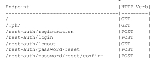

# Viewsets & Routers
Viewsets and routers are tools within DRF that can speed-up API development
- Additional layer of abstraction on top of views and URLs
- A single viewsets can replace multiple related views 
- A router can automatically generate URLs for the developer

## User Endpoints
Currently we have these endpoints:


What are goal now is to refactor our views and URLs to viewsets and and routers.

But first we will need to add two more endpoints to list users and specific users

### To write new endpoints we always need the following three steps
- new serializer class for the model
- new views for each endpoint
- new URL routes for each endpoint

1. Write the serializer
```python
# posts/serializers.py
from rest_framework import serializers 

from .models import Post

from django.contrib.auth import get_user_model

class PostSerializer(serializers.ModelSerializer):
    class Meta:
        fields = (
            'id',
            'author',
            'title',
            'body',
            'created_at',
        )

        model = Post

class UserSerializer(serializers.ModelSerializer):  # new
    class Meta:
        model = get_user_model()
        fields = (
            'id',
            'username',
        )
```
2. Define the views for the 2 new endpoints
```python
# posts/views.py
class UserList(generics.ListCreateAPIView):
    queryset = get_user_model.objects.all()
    serializer_class = UserSerializer

class UserDetail(generics.RetrieveUpdateDestroyAPIView):
    queryset = get_user_model().objects.all()
    serializer_class = UserSerializer
```
There is a lot of repeititon here like they all have the same models and serializer

3. Write the URLs
```python
from django.urls import path

from .views import PostList, PostDetail, UserList, UserDetail  

urlpatterns = [
    path('<int:pk>', PostDetail.as_view(), name="post_detail"),
    path("", PostList.as_view(), name="post_list"),
    path("users/", UserList.as_view()),
    path("users/<int:pk>", UserDetail.as_view()),
]
```

## Viewsets
A viewset is a way to combine the logic for multiple related views into a single class
- Currently, we have four. But we can reduce it to two: one for blog posts one for users
```python
# posts/views.py
from rest_framework import viewsets

class PostViewSet(viewsets.ModelViewSet):
    permission_classes = (IsAuthorOrReadOnly, )
    queryset = Post.objects.all()
    serializer_class = PostSerializer

class UserViewSet(viewsets.ModelViewSet):
    queryset = get_user_model().objects.all()
    serializer_class = UserSerializers
```

## Routers
Routers work firectly with viewsets to automatically generate URL patterns.
Our current `posts/urls.py` file has four URL patterns:
```python
urlpatterns = [
    path('<int:pk>', PostDetail.as_view(), name="post_detail"),
    path("", PostList.as_view(), name="post_list"),
    path("users/", UserList.as_view()),
    path("users/<int:pk>", UserDetail.as_view()),
]
```
- What we can do is instead adopt a single route for each viewset so two routes


- DRF has two default routers:
    - `SimpleRouter`
    - `DefaultRouter`
- It is possible to create cutome routers

```python
# posts/urls.py
from django.urls import path
from rest_framework.routers import SimpleRouter

from .views import UserViewSet, PostViewSet

router = SimpleRouter()
router.register("users", UserViewSet, basename="users")
router.register("", PostViewSet, basename="posts")

urlpatterns = router.urls
```

### WHERE's MY GENERICS?! Control?!
A `viewset` provides the logic for all standard CRUD (Create, Retrieve, Update, Delete) methods, but only the specific method that corresponds to the incoming HTTP request is executed.

Here's a breakdown:

* **`GET` request to `/posts/`:** Triggers the **`.list()`** method on the `viewset` to retrieve a collection of objects.
* **`GET` request to `/posts/1/`:** Triggers the **`.retrieve()`** method to get a single object.
* **`POST` request to `/posts/`:** Triggers the **`.create()`** method to make a new object.
* **`PUT` or `PATCH` request to `/posts/1/`:** Triggers the **`.update()`** method to modify an existing object.
* **`DELETE` request to `/posts/1/`:** Triggers the **`.destroy()`** method to delete an object.

The **`router`** is what handles the mapping between the URL and the correct method on the `viewset`, but it's the `viewset` itself that holds all the necessary logic in one place. This is what makes them so efficient for building REST APIs.

## Permissions
- It is important to think of a permission for every endpoint especially when user information is involved
- You can check different permissions to an endpoint by looking at the documentation
```python
#posts/views.py
from rest_framework import IsAdminUser

class PostViewSet(viewsets.ModelViewSet):
    permission_classes = (IsAuthorOrReadOnly, )
    queryset = Post.objects.all()
    serializer_class = PostSerializer

class UserViewSet(viewsets.ModelViewSet):
    permission_classes = [IsAdminUser]
    queryset = get_user_model().objects.all()
    serializer_class = UserSerializer
