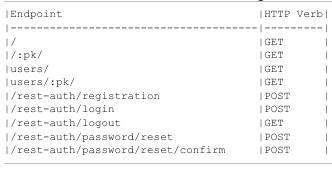

# Schema
Schema is a machine readable that documents your endpoints

Currently here are our endpoints:


---
Hover over the [OpenAPI](https://www.openapis.org) as it specifies how we should document our API

- `drf-spectacular` is the recommended third-party package for generating an OpenAPI 3 schema for DRF

1. Install `drf-spectacular`
2. Add it to the installed apps
```python
INSTALLED_APPS = [
    'django.contrib.admin',
    'django.contrib.auth',
    'django.contrib.contenttypes',
    'django.contrib.sessions',
    'django.contrib.messages',
    'django.contrib.staticfiles',
    'django.contrib.sites',  

    # 3rd party apps
    'rest_framework',
    'corsheaders', 
    'rest_framework.authtoken',
    'dj_rest_auth',
    'allauth',  
    'allauth.account',  
    'allauth.socialaccount',  
    'dj_rest_auth.registration',
    'drf_spectacular',  # new

    # local apps
    'accounts.apps.AccountsConfig',
    'posts.apps.PostsConfig',
]
```
3. Register `drf-spectacular` within the `REST_FRAMEWORK` section of the `django_project/settings.py`
```python
# django_project/settings.py
REST_FRAMEWORK = {
    ...

    "DEFAULT_SCHEMA_CLASS": 'drf_spectacular.openapi.AutoSchema'  # new
}
```
4. Add some metadata such as title, description, and version to the [default_settings](https://drf-spectacular.readthedocs.io/en/latest/settings.html) 
    - create a new section in `django_project/settings.py`
```python
# django_project/settings.py
SPECTACULAR_SETTINGS = {
    "TITLE": "Blog API Project",
    "DESCRIPTION": "A sample blog to learn about DRF",
    "VERSION": "1.0.0"

    # other settings
}
```
5. Generate the schema: 
`python manage.py spectacular --file schema.yml`

A new file will be generated.

# Dynamic Schema
A more dynamic approach is to serve schema directly from our API as a URL route.
1. To do this, import `SpectacularAPIView` and then 
2. add a new URL path at `api/schema` to display it

```python
# django_project/urls
from django.contrib import admin
from django.urls import path, include
from drf_spectacular.views import SpectacularAPIView  # new

urlpatterns = [
    path('admin/', admin.site.urls),
    path('api/v1/', include('posts.urls')),
    path("api-auth/", include('rest_framework.urls')),
    path("api/v1/dj-rest-auth/", include("dj_rest_auth.urls")), 
    path("api/v1/dj-rest-auth/registration/", include("dj_rest_auth.registration.urls")),  
    path("api/schema/", SpectacularAPIView.as_view(), name="schema") # new
]
```
3. Start up the server and navigate to the new schema URL. This will be downloaded as a file 
